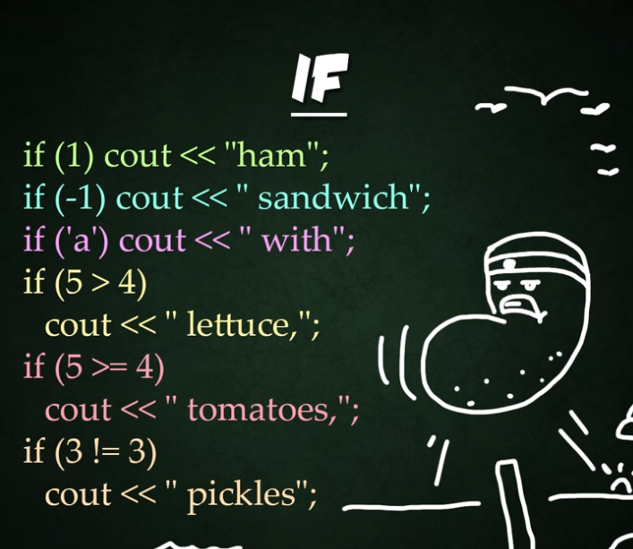
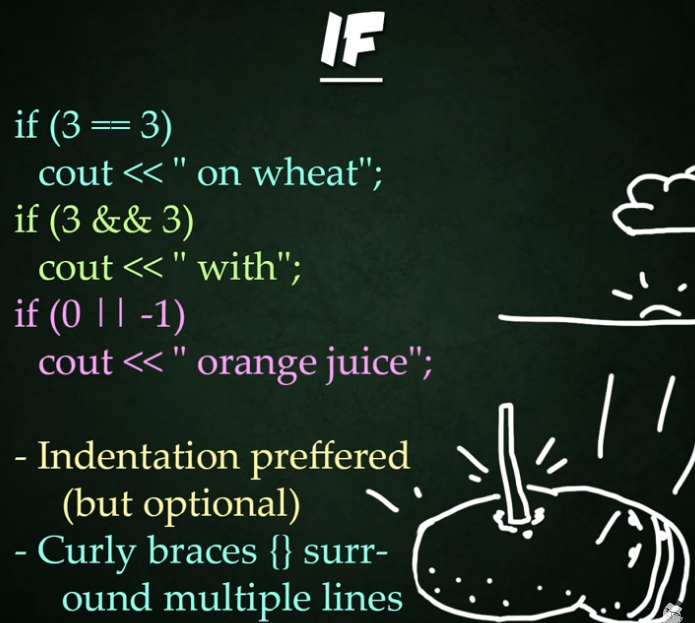
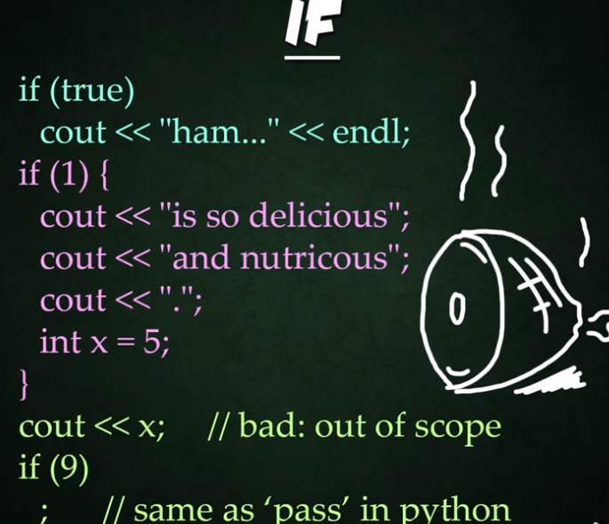
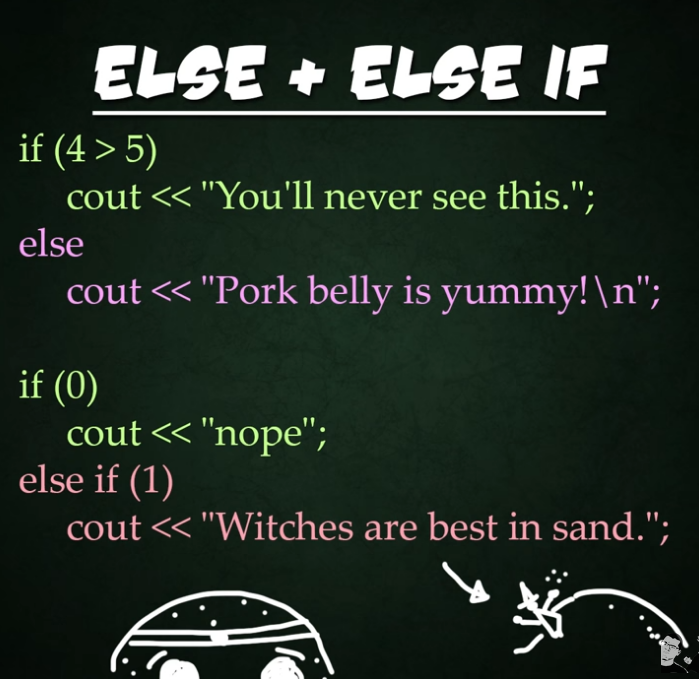
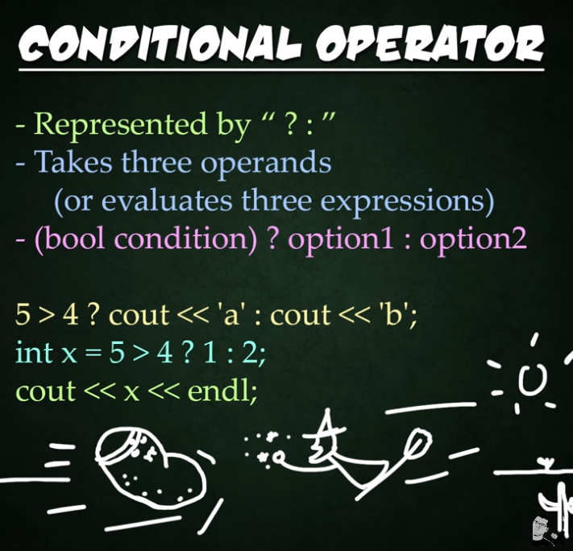
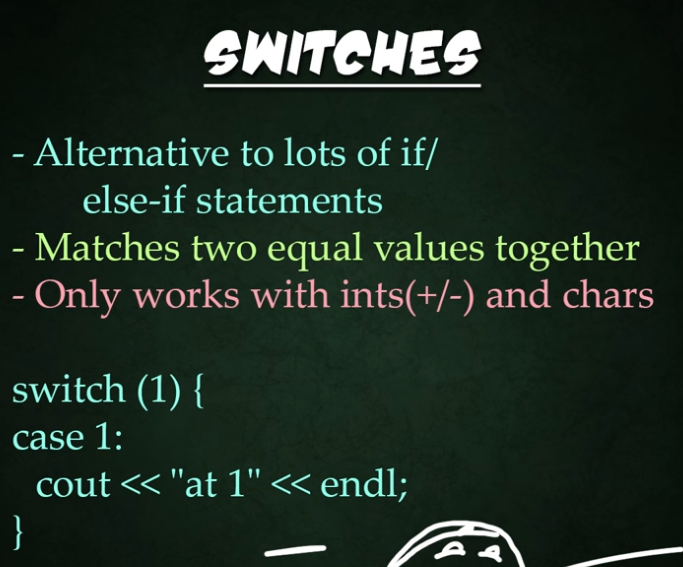
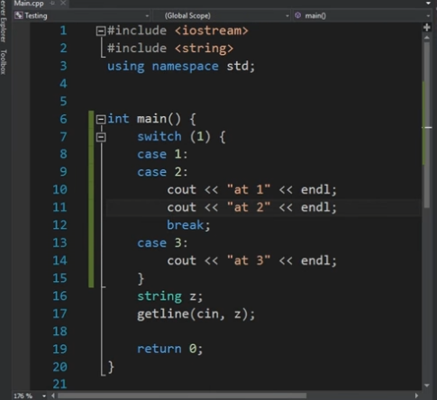

# If Else Switch
Visit the source: [Trevor Payne Let's Learn C++ Basics](https://www.youtube.com/watch?v=-6ZkRmhL3QY)







In this if statement we can pass the execution (like in Python pass syntax) but in this case we just put ; and does not put any command in the if consequence or else consequence body.










```c++
//FINAL CHALLENGES
    //1. Create 3 "if" statements with '1', true and false as the arguments but DO NOTHING!
    if (1) ;
    if (true)
        ;
    if (false) {
        ;
    }

    // 2. Create 3 'if' 'else if' statements that check an int to see if it's >, == or < 0. Then output each as a statement 
    if (5 > 0) {
        cout << "5 > 0" << endl;
    }
    else if (5 == 0) {
        cout << "5 == 0" << endl;
    }
    else if (5 < 0) {
        cout << "5 > 0" << endl;
    }

    // 3. Create an if else statement that checks if a variable is odd/even and output just that along with lots of other random days of the week in a block of code using {}
    if (x % 2 == 0){
        cout << "x is even" << endl;
    }
    else {
        cout << "x is odd" << endl;
    }
```