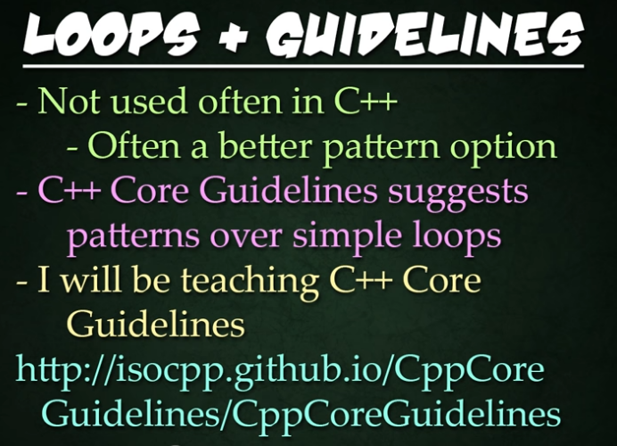
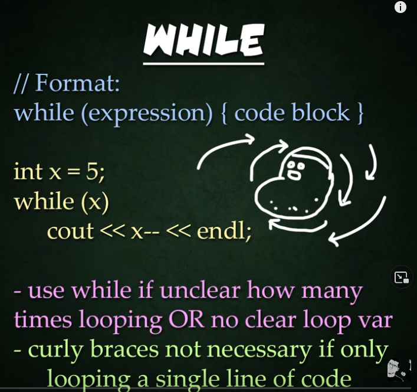
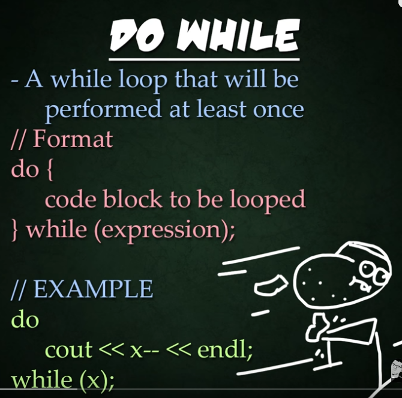
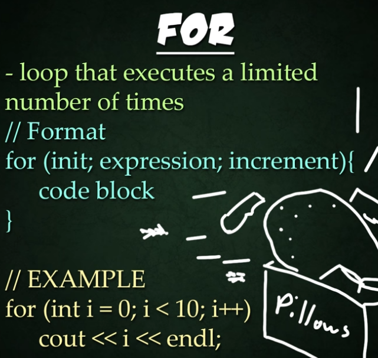
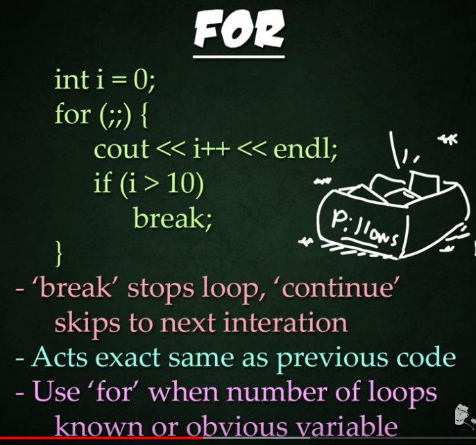
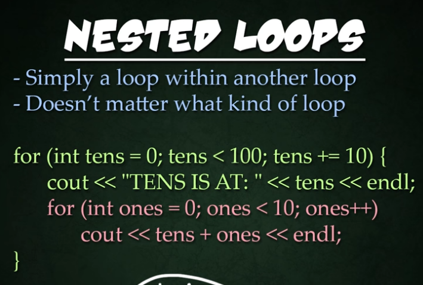
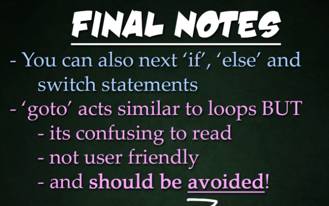
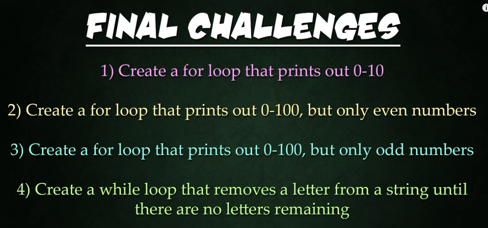

# LOOP in C++
There are For, While, Do, Nested loops.



## WHILE LOOP
use while if unclear how many times the loop will persist.




## DO WHILE LOOP
loop will be occur at least one since the checker is in the last after the code block.




## FOR LOOPS
this is loop executed in a limited number of times (specified in the code)






## NESTED LOOPS

Here is nested loop



## Final Notes
Pay attention to these final notes about nested if. 
Also about another type of flow control which is Goto and why it is not recommended to use. 



## FINAL CHALLENGE



```c++
// final challenge:
    // 1. Create a for loop that prints out 0-10 (done on example above 2 in fact)
    // 2. Create a for loop that prints out 0-100, but only even number
    cout << "0-100 but even number only: " << endl;
    for (int i = 0; i <= 100; i++)
    {
        /* code */
        if (i % 2 == 0)
        {
           cout << i << endl;
        }
        
    }

    // 3. Create a for loop that prints out 0-100 but only odd numbers
    cout << "0-100 but only odd numbers: " << endl;
    for (int i = 0; i <= 100; i++)
    {
        /* code */
        if (i % 2 == 0)
        {
           continue; // not printed the nubmer and continue to the next iteration
        }
        cout << i << endl;
    }

    // 4. Create a while loop that removes a letter from a string until there are no letters remaining.
    
    string s = "Hello";
    cout << "the string: " << s << endl;
    int r = 0; //this is the index to char in string
    while (r < s.length()) {
        s[r] = ' '; //subs the char with whitespace
        r++;
    }
    cout << "the string after: " << s << endl;
```

Revision on answer number 4:
```c++
// 4. Create a while loop that removes a letter from a string until there are no letters remaining.
    
    char s[] = "Hello";
    cout << "the string: " << s << endl;
    
    while (strlen(s)) {
        s[strlen(s) - 1] = '\0';
        cout << s << endl;
    }
    cout << "the string length after: " << strlen(s) << endl;
```