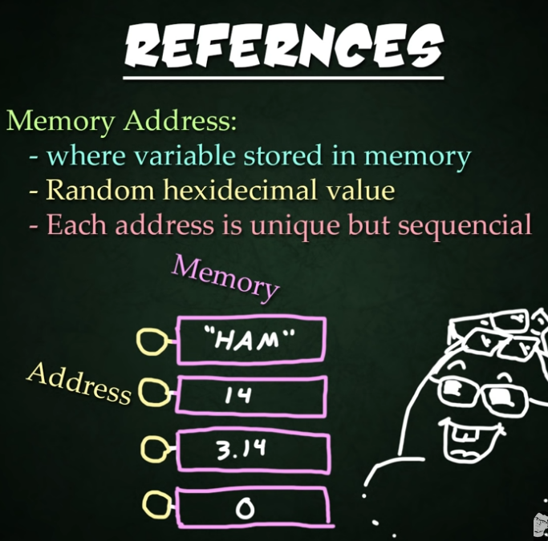
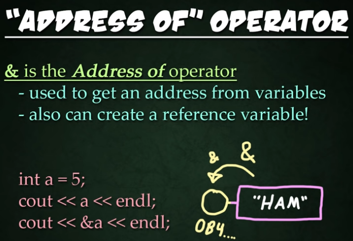
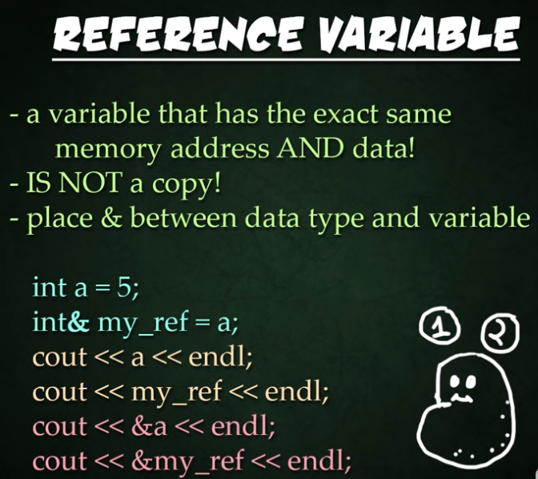
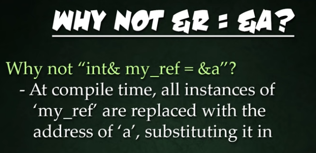
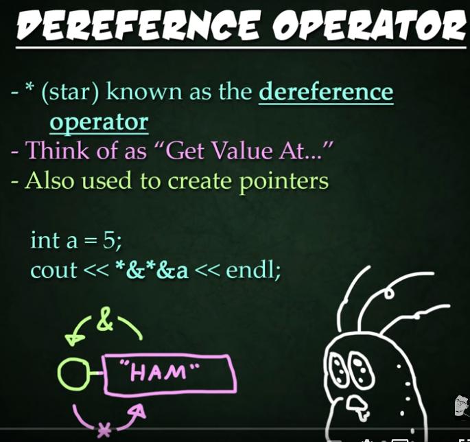
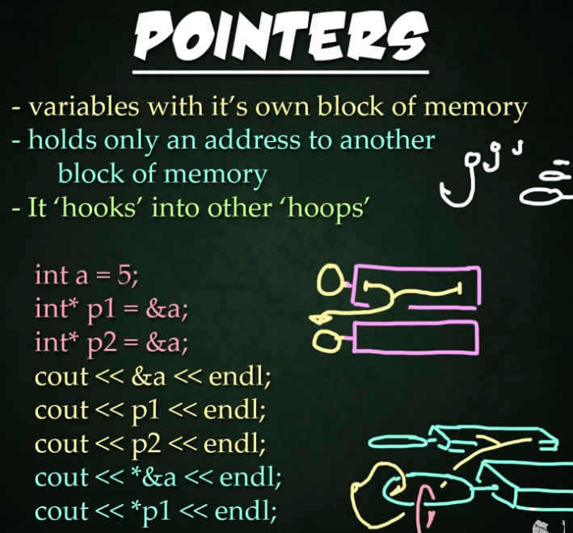
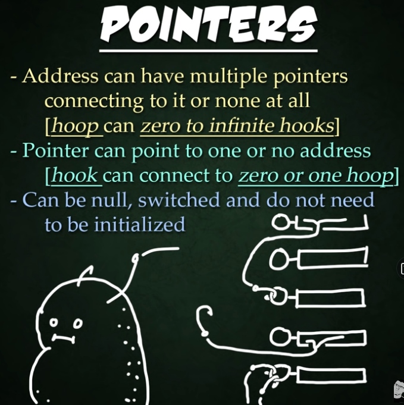
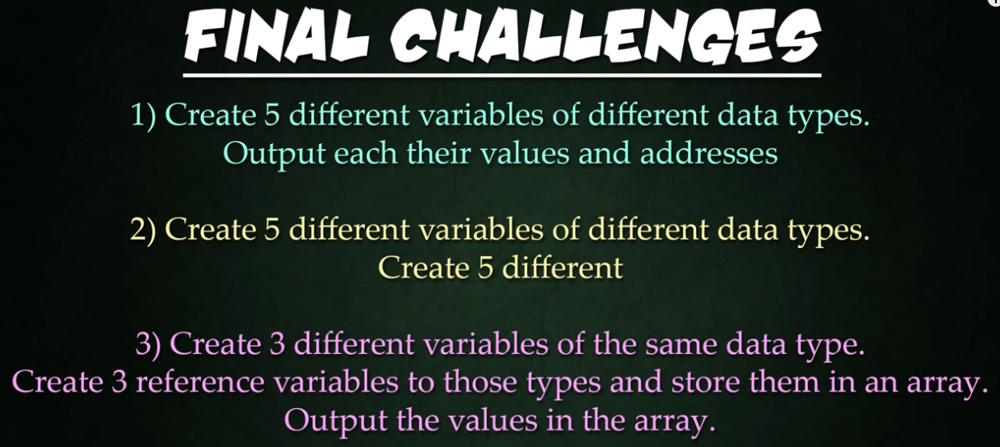

# C++ Basics: References and Pointers
here is a slide in reference:









;








```c++
//CHALLENGE: 
    // 1. Create 5 different variables of different data types. Output each their values and addresses
    // 2. Create 5 different variables of different data types. Create 5 different
    // 3. Create 3 different variables of the same type, Create 3 reference variables to those types and store them in an array. Output the values in the array.

    cout << "Final Challenge" << endl;
    cout << "challenge number 1" << endl;
    bool v1 = true;
    int v2 = 2;
    float v3 = 3.45;
    double v4 = 5.783466639498;
    string v5 = "Hello World";

    cout << "variable 1= " << v1 << endl;
    cout << "addres v 1= " << & v1 << endl;
    cout << "variable 2= " << v2 << endl;
    cout << "addres v 2= " << & v2 << endl;
    cout << "variable 3= " << v3 << endl;
    cout << "addres v 3= " << & v3 << endl;
    cout << "variable 4= " << v4 << endl;
    cout << "addres v 4= " << & v4 << endl;
    cout << "variable 5= " << v5 << endl;
    cout << "addres v 5= " << & v5 << endl;

    // Challange 3
    cout << "challenge 3" << endl;
    string s1 = "We got a problem";
    string s2 = "Houston Hello";
    string s3 = "1..2...3...Mayday";

    // make array of its reference variables
    string* sparray[]{&s1, &s2, &s3};
    // test 
    cout << "sparray address: " << sparray << endl;
    cout << "sparray 0 address: " << &sparray[0] << endl;
    cout << "sparray[0] value: " << sparray[0] << endl;
    cout << "deref sparray[0]: " << *(*sparray) << endl; // the address of the array is the address of its first (0th) element!
    cout << "deref sparray[1]: " << **(sparray + 1) << endl;
    cout << "deref sparray[2]: " << *sparray[2] << endl;
```