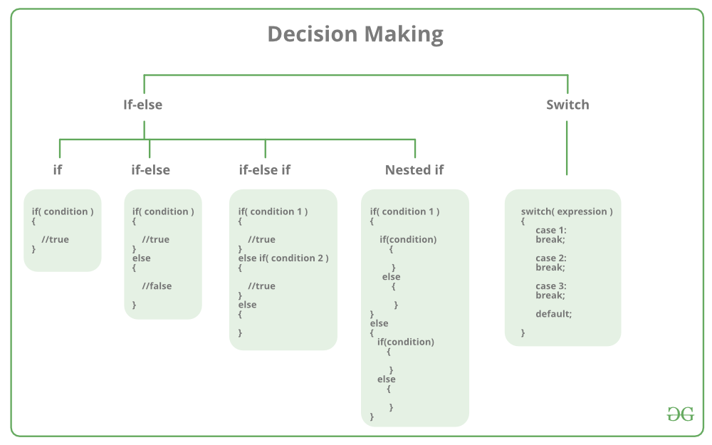
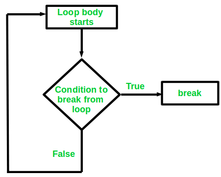
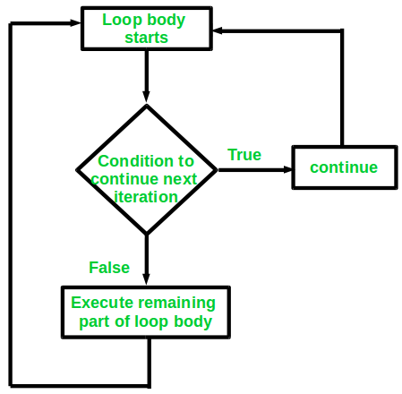

# Decision Making in C/C++ (if, if..else, Nested-if, if-else-if)
Here is the diagram of decision making methods in C++:



## The if Statements Variations
If statement is the most basic decision making statement. Syntax:
```c++
if(condition) 
{
   // Statements to execute if
   // condition is true
}
```
here is the practical example:
```c++
// C program to illustrate If statement
#include <stdio.h>

int main() {
	int i = 10;

	if (i > 15)
	{
	printf("10 is less than 15");
	}
	
	printf("I am Not in if");
}
```
the result will be "I am not in if".

The next variant is if - else statement:
```c++
if (condition)
{
    // Executes this block if
    // condition is true
}
else
{
    // Executes this block if
    // condition is false
}
```
here is the practical exmaple:
```c++
// C program to illustrate If statement
#include <stdio.h>

int main() {
	int i = 20;

	if (i < 15){
	
		printf("i is smaller than 15");
	}
	else{
	
		printf("i is greater than 15");
	}	
	return 0;
}
```
The output will be "i is greater than 15".

Next is nested if:
```c++
if (condition1) 
{
   // Executes when condition1 is true
   if (condition2) 
   {
      // Executes when condition2 is true
   }
}
```
here is the practical example:
```c++
// C program to illustrate nested-if statement
#include <stdio.h>

int main() {
	int i = 10;

	if (i == 10)
	{
		// First if statement
		if (i < 15)
		printf("i is smaller than 15\n");

		// Nested - if statement
		// Will only be executed if statement above
		// is true
		if (i < 12)
			printf("i is smaller than 12 too\n");
		else
			printf("i is greater than 15");
	}

	return 0;
}
```
the output will be two lines: "i is smaller than 15"  
"i is smaller than 12 too"

The next variant is if - else if ladder which consist on other conditional if in the same level as the previous if:
```c++
if (condition)
    statement;
else if (condition)
    statement;
.
.
else
    statement;
```
Here is the practical example:
```c++
// C program to illustrate nested-if statement
#include <stdio.h>

int main() {
	int i = 20;

	if (i == 10)
		printf("i is 10");
	else if (i == 15)
		printf("i is 15");
	else if (i == 20)
		printf("i is 20");
	else
		printf("i is not present");
}
```
the output will be "i is 20"

## Jump Statement in C++
These statements are used in C or C++ for the unconditional flow of control throughout the function in a program. 
They support four types of jump statements:

### C break
This ***loop control*** statement is used to terminate the loop.
As soon as the break statement is encountered from within the loop, the loop iterations stop there, and control returns from the loop immediately to the first statement after the loop.
Here is the algorithm of a break situation:



Here is the practical example:
```c++
// C program to illustrate
// Linear Search

#include <stdio.h>

void findElement(int arr[], int size, int key)
{
	// loop to traverse array and search for key
	for (int i = 0; i < size; i++) {
		if (arr[i] == key) {
			printf("Element found at position: %d", (i + 1));
			break;
		}
	}
}

int main() {
	int arr[] = { 1, 2, 3, 4, 5, 6 };
	
	// no of elements
	int n = 6;
	
	// key to be searched
	int key = 3;

	// Calling function to find the key
	findElement(arr, n, key);

	return 0;
}
```
The code above will print: "Element found at position: 3"  
But it is not the printed output that matters most here, it is how it got there.
The break statement stops the loop iterations and then return to the main function to continue to return 0;

### Continues
This ***Loop Control*** statement is the opposite of the break statement.
Instead of terminating the loop iterations, it forces to execute the next iteration of the loop.
But with one caveat, if the condition for continue statement is fulfilled it will skip the iteration state to the next and the commands of the loop body under the continue statement will be skipped for this iteration but executed in the next assuming the next iteration does not satisfy the specification of the continue test statement.
Here is the algorithm structure for continue:



Here is the practical example:
```c++
// C program to explain the use
// of continue statement
#include <stdio.h>

int main() {
	// loop from 1 to 10
	for (int i = 1; i <= 10; i++) {

		// If i is equals to 6,
		// continue to next iteration
		// without printing
		if (i == 6)
			continue;

		else
			// otherwise print the value of i
			printf("%d ", i);
	}

	return 0;
}
```
This will print all numbers between 1 to 10 EXCEPT 6!

#### NOTE: 
If you create a variable inside if-else statement or loop block in C/C++, it will be local to the block only. You can use global variable inside the if-else and loop block. However, if the name of the global variable is the same as the name of the local variable, as long as the pointer is inside the block then the priority will be the local variable.

## C GOTO
This is old school non conditional jump statement. It can be used to jump from one point to another within a function.
However, it require a label is declared as reference to where it needs to jump to.
